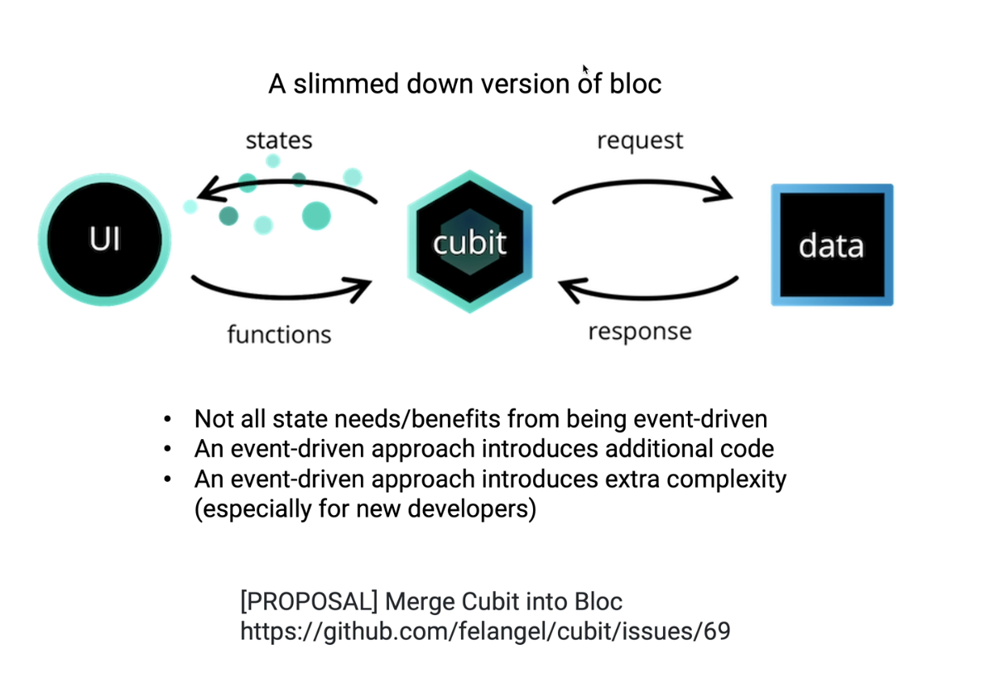
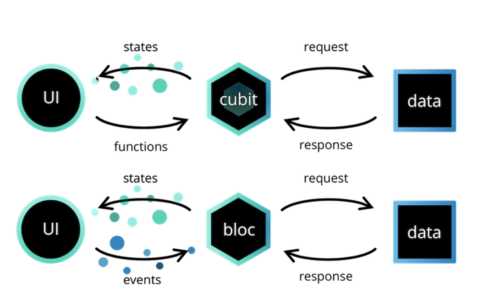

# mywebapp

A new Flutter project.

## Getting Started

This project is a starting point for a Flutter application.

A few resources to get you started if this is your first Flutter project:

- [Lab: Write your first Flutter app](https://docs.flutter.dev/get-started/codelab)
- [Cookbook: Useful Flutter samples](https://docs.flutter.dev/cookbook)

For help getting started with Flutter development, view the
[online documentation](https://docs.flutter.dev/), which offers tutorials,
samples, guidance on mobile development, and a full API reference.

# Features of BLOC

* reads the event that occurred in UI
* Analyze the event, and request the appropriate handler to handle it.
* The event handler process the event thru interaction with the data sources
* Reflect the new data resulting from the event processing to the UI

## Articles on cubit and bloc

https://medium.flutterdevs.com/cubit-state-management-flutter-d372ec0044f7

https://www.udemy.com/user/sangwook-cho-3/
